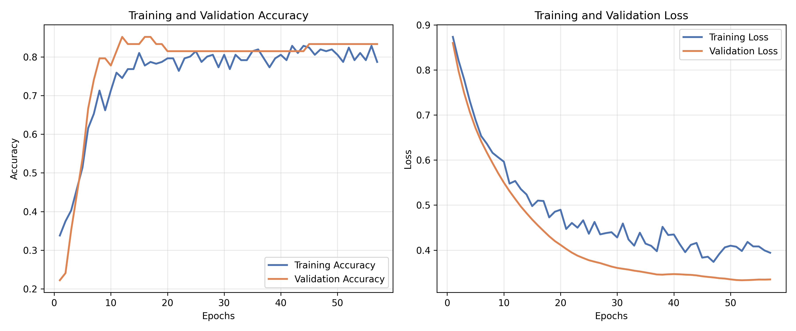
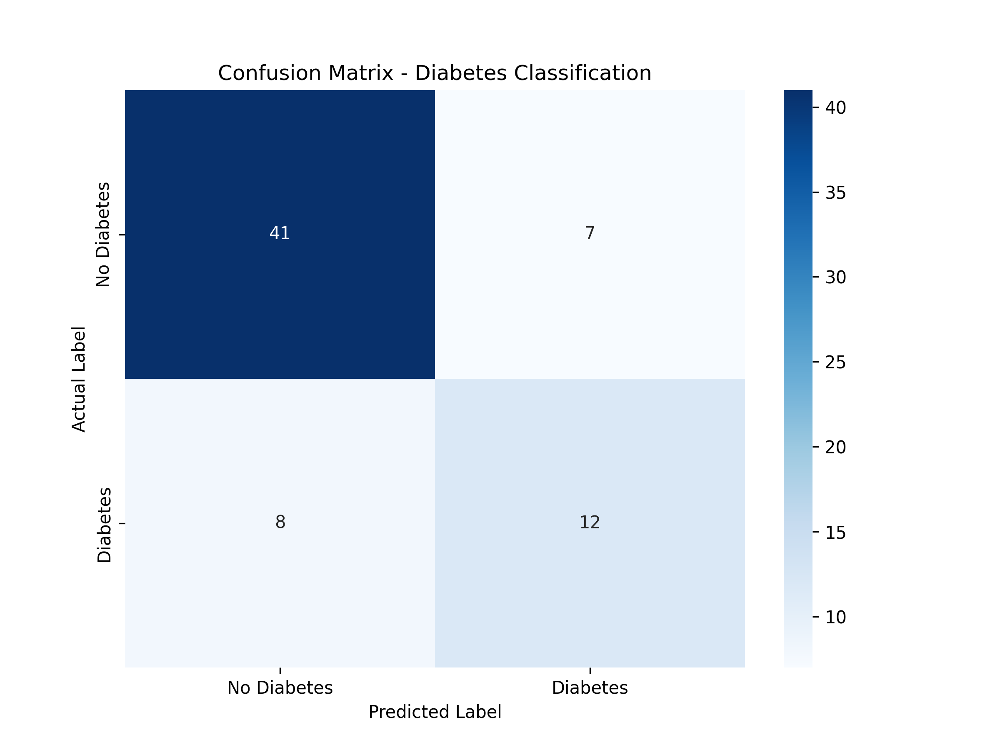

# 🧠 Neural Network for Diabetes Prediction

> A deep learning pipeline for binary classification of diabetes using the **Pima Indians Diabetes Dataset**. Built with TensorFlow/Keras, featuring end-to-end data preprocessing, exploratory data analysis, model training, and evaluation.

---

## 📑 Table of Contents

- [Overview](#overview)
- [Project Structure](#project-structure)
- [Dataset](#dataset)
- [Pipeline Stages](#pipeline-stages)
  - [1. Data Acquisition](#1-data-acquisition)
  - [2. Exploratory Data Analysis (EDA)](#2-exploratory-data-analysis-eda)
  - [3. Data Preprocessing](#3-data-preprocessing)
  - [4. Model Architecture](#4-model-architecture)
  - [5. Training](#5-training)
  - [6. Evaluation](#6-evaluation)
- [Results](#results)
- [How to Reproduce](#how-to-reproduce)
- [Dependencies](#dependencies)
- [Acknowledgements](#acknowledgements)

---

## Overview

This project builds a **feed-forward neural network with Dropout regularization** to predict whether a patient has diabetes based on 8 diagnostic measurements. The pipeline covers data downloading, cleaning, EDA, model design, training with early stopping, and comprehensive evaluation.

| Item              | Detail                                            |
| ----------------- | ------------------------------------------------- |
| **Task**          | Binary Classification (Diabetic vs. Non-Diabetic) |
| **Framework**     | TensorFlow / Keras                                |
| **Dataset**       | Pima Indians Diabetes Database (UCI via Kaggle)   |
| **Best Accuracy** | **77.94 %**                                       |
| **Best ROC AUC**  | **0.7771**                                        |

---

## Project Structure

```
neural-network-diabetes/
├── dataset/
│   ├── download.py              # Kaggle API download script
│   ├── diabetes.csv             # Raw dataset (768 × 9)
│   └── diabetes_cleaned.csv     # Preprocessed dataset (after cleaning)
│
├── notebooks/
│   ├── dataset_eda.ipynb        # Exploratory Data Analysis
│   ├── dataset_preprocess.ipynb # Data cleaning & feature engineering
│   ├── pima_diabetes_nn.ipynb   # Model training & evaluation notebook
│   └── tutorial_1.ipynb         # Heart Disease NN tutorial (reference)
│
├── scripts/
│   ├── dataloader.py            # Data loading & stratified splitting
│   └── model.py                 # DiabetesNN model class definition
│
├── results/
│   ├── confusion_matrix.png     # Test-set confusion matrix
│   ├── training_curves.png      # Accuracy & loss curves over epochs
│   └── metrics_summary.txt      # Classification metrics summary
│
├── .env                         # Kaggle API credentials (not tracked)
├── .gitignore
├── requirements.txt
└── README.md
```

---

## Dataset

**Source:** [Pima Indians Diabetes Database — Kaggle](https://www.kaggle.com/datasets/uciml/pima-indians-diabetes-database)

The dataset originates from the **National Institute of Diabetes and Digestive and Kidney Diseases** and contains diagnostic measurements from **768 female patients** of Pima Indian heritage, aged 21+.

### Features (8 input variables)

| #   | Feature                      | Description                                                       |
| --- | ---------------------------- | ----------------------------------------------------------------- |
| 1   | **Pregnancies**              | Number of pregnancies                                             |
| 2   | **Glucose**                  | Plasma glucose concentration (2-hour oral glucose tolerance test) |
| 3   | **BloodPressure**            | Diastolic blood pressure (mm Hg)                                  |
| 4   | **SkinThickness**            | Triceps skin fold thickness (mm)                                  |
| 5   | **Insulin**                  | 2-hour serum insulin (μU/mL)                                      |
| 6   | **BMI**                      | Body mass index (weight in kg / height in m²)                     |
| 7   | **DiabetesPedigreeFunction** | Diabetes pedigree function (genetic influence)                    |
| 8   | **Age**                      | Age in years                                                      |

### Target

| Value | Label        |
| ----- | ------------ |
| 0     | Non-Diabetic |
| 1     | Diabetic     |

**Class Distribution:** ~65% Non-Diabetic / ~35% Diabetic (imbalanced)

---

## Pipeline Stages

### 1. Data Acquisition

The raw dataset is downloaded programmatically from Kaggle using the `kagglehub` library.

**Script:** [`dataset/download.py`](dataset/download.py)

**How it works:**

1. Loads Kaggle credentials (`KAGGLE_USERNAME`, `KAGGLE_API_TOKEN`) from a `.env` file
2. Downloads the dataset via `kagglehub.dataset_download()`
3. Copies the CSV file into the `dataset/` folder

```bash
# Make sure your .env file contains:
KAGGLE_USERNAME=your_username
KAGGLE_API_TOKEN=your_api_key

# Run the download script
python dataset/download.py
```

---

### 2. Exploratory Data Analysis (EDA)

**Notebook:** [`notebooks/dataset_eda.ipynb`](notebooks/dataset_eda.ipynb)

A thorough EDA was performed to understand the dataset characteristics before modeling:

| Analysis          | Key Findings                                                                                                          |
| ----------------- | --------------------------------------------------------------------------------------------------------------------- |
| **Shape**         | 768 samples × 9 columns (8 features + 1 target)                                                                       |
| **Data Types**    | 2 float64, 7 int64 — all numeric, no missing values (NaN)                                                             |
| **Zero Values**   | Biologically impossible zeros found in: Glucose (5), BloodPressure (35), SkinThickness (227), Insulin (374), BMI (11) |
| **Class Balance** | ~65% Non-Diabetic (500) / ~35% Diabetic (268)                                                                         |
| **Correlations**  | Glucose, BMI, and Age have the strongest correlation with Outcome                                                     |
| **Distributions** | Several features are right-skewed; Insulin has significant outliers                                                   |

**Visualizations produced include:**

- Distribution histograms for all features
- Correlation heatmap
- Box plots for outlier detection
- Class distribution bar/pie charts
- Pair plots for feature relationships

---

### 3. Data Preprocessing

**Notebook:** [`notebooks/dataset_preprocess.ipynb`](notebooks/dataset_preprocess.ipynb)

The preprocessing pipeline applies **four key transformations** to prepare the data for deep learning:

#### Step 1 — Handle Biological Impossibilities

Columns like Glucose, BloodPressure, SkinThickness, Insulin, and BMI **cannot be zero** in a living patient. Zeros are replaced with the **column median** (robust to outliers).

| Column        | Zeros Replaced |
| ------------- | -------------- |
| Glucose       | 5              |
| BloodPressure | 35             |
| SkinThickness | 227            |
| Insulin       | 374            |
| BMI           | 11             |

#### Step 2 — Remove Outliers (IQR Method)

Outliers are detected and removed using the **Interquartile Range (IQR)** method:

- Q1 = 25th percentile, Q3 = 75th percentile
- IQR = Q3 − Q1
- Valid range: [Q1 − 1.5 × IQR, Q3 + 1.5 × IQR]

#### Step 3 — Feature Normalization (StandardScaler)

All features are standardized to have **zero mean and unit variance** using `sklearn.preprocessing.StandardScaler`, which is essential for neural network convergence.

#### Step 4 — Export

The cleaned and scaled data is saved to `dataset/diabetes_cleaned.csv` for downstream use.

---

### 4. Model Architecture

**Script:** [`scripts/model.py`](scripts/model.py)

The model is a **feed-forward neural network** implemented as a custom Keras `Model` subclass (`DiabetesNN`):

```
Input (8 features)
    │
    ▼
Dense(32, ReLU)    ← Hidden Layer 1
Dropout(0.2)
    │
    ▼
Dense(16, ReLU)    ← Hidden Layer 2
Dropout(0.2)
    │
    ▼
Dense(1, Sigmoid)  ← Output Layer (probability of diabetes)
```

| Component            | Detail                                                                           |
| -------------------- | -------------------------------------------------------------------------------- |
| **Hidden Layers**    | 2 fully-connected layers (32 → 16 neurons)                                       |
| **Activation**       | ReLU (hidden), Sigmoid (output)                                                  |
| **Regularization**   | Dropout (rate = 0.2) after each hidden layer                                     |
| **Total Parameters** | 833 (3.25 KB)                                                                    |
| **Configurability**  | `input_dim`, `hidden_units`, `dropout_rate`, and `activation` are all adjustable |

---

### 5. Training

**Notebook:** [`notebooks/pima_diabetes_nn.ipynb`](notebooks/pima_diabetes_nn.ipynb)

**Data Loader:** [`scripts/dataloader.py`](scripts/dataloader.py)

#### Data Splitting Strategy

- **Stratified 80/20 split** to preserve class ratios in train and test sets
- Training set: 270 samples (78 Diabetic, 192 Non-Diabetic)
- Test set: 68 samples (20 Diabetic, 48 Non-Diabetic)
- Random seed: 42 (for reproducibility)

#### Training Configuration

| Hyperparameter       | Value                              |
| -------------------- | ---------------------------------- |
| **Optimizer**        | AdamW                              |
| **Learning Rate**    | 0.001                              |
| **Loss Function**    | Binary Crossentropy                |
| **Batch Size**       | 32                                 |
| **Max Epochs**       | 100                                |
| **Validation Split** | 0.2 (of training data)             |
| **Early Stopping**   | Patience = 5 (monitors `val_loss`) |

#### Training Curves

The model converges around **epoch 50–55** with consistent validation performance:



- **Accuracy** stabilizes at ~80–85% for both train and validation
- **Loss** steadily decreases; validation loss plateaus around 0.23
- No severe overfitting observed (training and validation curves track closely)

---

### 6. Evaluation

The model is evaluated on the **held-out test set** (68 samples, never seen during training):

#### Classification Metrics

| Metric                   | Score           |
| ------------------------ | --------------- |
| **Accuracy**             | 0.7794 (77.94%) |
| **Precision**            | 0.6316          |
| **Recall (Sensitivity)** | 0.6000          |
| **F1-Score**             | 0.6154          |
| **ROC AUC**              | 0.7771          |

> **Note:** Recall (Sensitivity) is prioritized in this medical context to minimize **False Negatives** — patients with diabetes who are incorrectly classified as healthy.

#### Confusion Matrix



|                         | Predicted: No Diabetes | Predicted: Diabetes |
| ----------------------- | :--------------------: | :-----------------: |
| **Actual: No Diabetes** |        41 (TN)         |       7 (FP)        |
| **Actual: Diabetes**    |         8 (FN)         |       12 (TP)       |

- **True Negatives:** 41 — correctly identified non-diabetic patients
- **True Positives:** 12 — correctly identified diabetic patients
- **False Positives:** 7 — healthy patients flagged as diabetic
- **False Negatives:** 8 — diabetic patients missed by the model

---

## Results

A summary of all key results is available in [`results/metrics_summary.txt`](results/metrics_summary.txt):

```
Classification Metrics Summary
==============================
Accuracy:  0.7794
Precision: 0.6316
Recall:    0.6000 (Sensitivity)
F1-Score:  0.6154
ROC AUC:   0.7771
==============================
Note: Recall (Sensitivity) is prioritized to minimize False Negatives.
```

**Saved artifacts:**
| File | Description |
|------|-------------|
| `results/metrics_summary.txt` | Numeric metrics summary |
| `results/confusion_matrix.png` | Confusion matrix heatmap |
| `results/training_curves.png` | Accuracy & loss curves over training epochs |

---

## How to Reproduce

Follow these steps to replicate the results from scratch:

### Prerequisites

- Python 3.10+
- A Kaggle account with API credentials

### Step-by-Step

```bash
# 1. Clone the repository
git clone https://github.com/yusufafify/neural-network-diabetes.git
cd neural-network-diabetes

# 2. Create and activate a virtual environment
python -m venv .venv
# Windows:
.venv\Scripts\activate
# macOS/Linux:
source .venv/bin/activate

# 3. Install dependencies
pip install -r requirements.txt

# 4. Set up Kaggle credentials
#    Create a .env file in the project root:
echo KAGGLE_USERNAME=your_username > .env
echo KAGGLE_API_TOKEN=your_api_key >> .env

# 5. Download the dataset
python dataset/download.py
```

### Running the Notebooks (in order)

| Order | Notebook                             | Purpose                                      |
| :---: | ------------------------------------ | -------------------------------------------- |
|   1   | `notebooks/dataset_eda.ipynb`        | Explore the raw dataset                      |
|   2   | `notebooks/dataset_preprocess.ipynb` | Clean data → produces `diabetes_cleaned.csv` |
|   3   | `notebooks/pima_diabetes_nn.ipynb`   | Train the model & generate results           |

```bash
# Launch Jupyter
jupyter notebook
# Then open each notebook in the order above and run all cells
```

> **Note:** The `tutorial_1.ipynb` notebook is a reference tutorial on neural networks for binary classification using the Heart Disease dataset. It is included for learning purposes and is not part of the main pipeline.

---

## Dependencies

All dependencies are listed in [`requirements.txt`](requirements.txt):

| Package         | Purpose                                                |
| --------------- | ------------------------------------------------------ |
| `tensorflow`    | Deep learning framework (model, training, evaluation)  |
| `scikit-learn`  | Data splitting, StandardScaler, classification metrics |
| `numpy`         | Numerical operations                                   |
| `pandas`        | Data loading and manipulation                          |
| `matplotlib`    | Plotting training curves and visualizations            |
| `seaborn`       | Enhanced statistical visualizations (EDA)              |
| `kagglehub`     | Downloading datasets from Kaggle                       |
| `python-dotenv` | Loading environment variables from `.env`              |

Install all at once:

```bash
pip install -r requirements.txt
```

---

